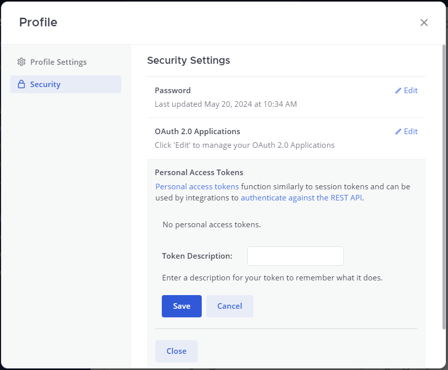
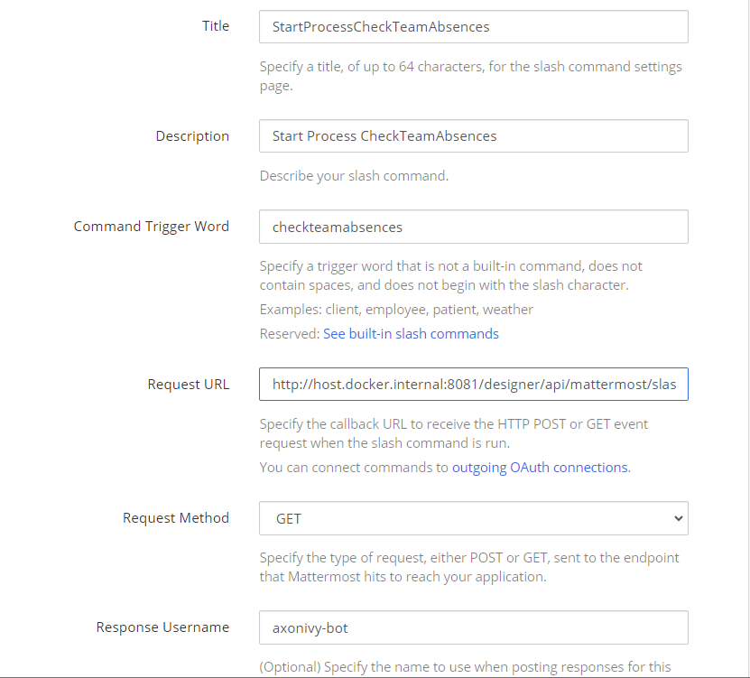

# Mattermost Connector

Mattermost is a messaging platform for teams, providing channels for organized communication and collaboration in workplaces. It's known for its ease of use and integration with other tools, helping teams streamline their workflows.

## Demo

1. Call Slash command on the masttermost instance's chat

2. Click on the link, start and finish task.


### Setup

Mattermost Instance

1. Ref to [Deploy Mattermost](https://docs.mattermost.com/guides/deployment.html).
2. Create Team, User, ...
3. Go to the System Console to enable Personal Access Tokens

4. Go to the Profile and create Personal Access Tokens on the Security tab. The Access Token is used for the ivy variable configuration.

5. Enable Bot Account Creation and create a bot account for sending notification to the channel Axon Ivy. E.g. axonivy-bot
6. Create a slash command in the Integrations menu.

7. Create a incoming webhook for the channel that the axonivy can use and post data to the selected channel.


Add the following `Variables` to your `variables.yaml`:

- `Variables.mattermost.baseUrl`
- `Variables.mattermost.accessToken`
- `Variables.mattermost.teamName`
- `Variables.mattermost.botName`

and replace the values with your given setup.

```
@variables.yaml@
```
