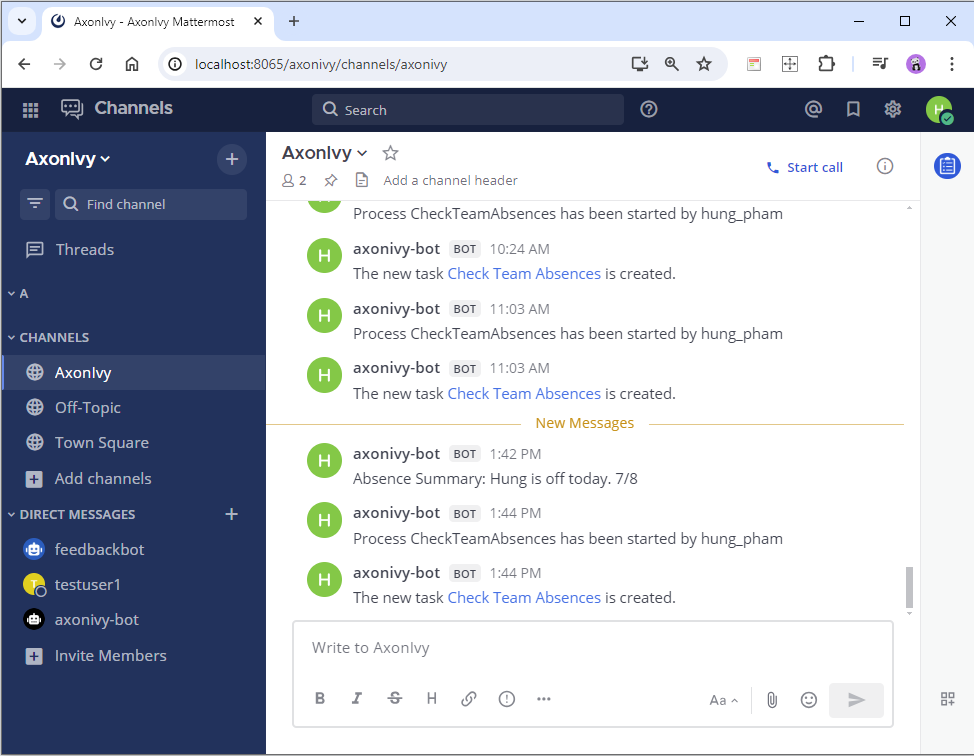

# Mattermost Connector

AxonIvy’s mattermost connector helps you to accelerate process automation initiatives by integrating Mattermost features into your process application within no time. This connector:

- Gives you full power to the [Mattermost's APIs](https://api.mattermost.com/).
- Allow you to start the AxonIvy process by hitting the slash command key from the mattermost's channel.
- Allow you to send a message to the mattermost's channel from the AxonIvy workplace.
- Notifies users on the channel for new AxonIvy workflow Tasks.
- Supports you with an easy-to-copy demo implementation to reduce your integration effort.

## Demo

1. Hit the slash command key on the channel's chat.
The Axon Ivy process will be triggered and create a new task.
The task's information will be sent to the channel by a message.


2. Click on the link, start and finish task.
The data from this task will be sent back to the channel.



### Setup

Mattermost Instance

1. Ref to [Deploy Mattermost](https://docs.mattermost.com/guides/deployment.html).
2. Create Team, User, ...
3. Go to the System Console to enable Personal Access Tokens

4. Go to the Profile and create Personal Access Tokens on the Security tab. The Access Token is used for the ivy variable configuration.

5. Enable Bot Account Creation and create a bot account for sending notification to the channel Axon Ivy. E.g. axonivy-bot
6. Create a slash command in the Integrations menu.

7. Create a incoming webhook for the channel that the axonivy can use and post data to the selected channel.


Add the following `Variables` to your `variables.yaml`:

- `Variables.mattermost.baseUrl`
- `Variables.mattermost.accessToken`
- `Variables.mattermost.teamName`
- `Variables.mattermost.botName`

and replace the values with your given setup.

```
@variables.yaml@
```
