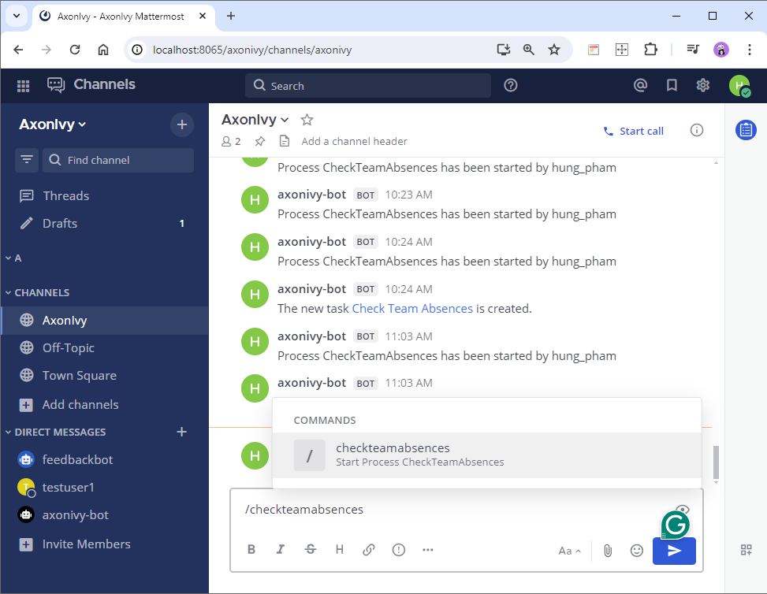
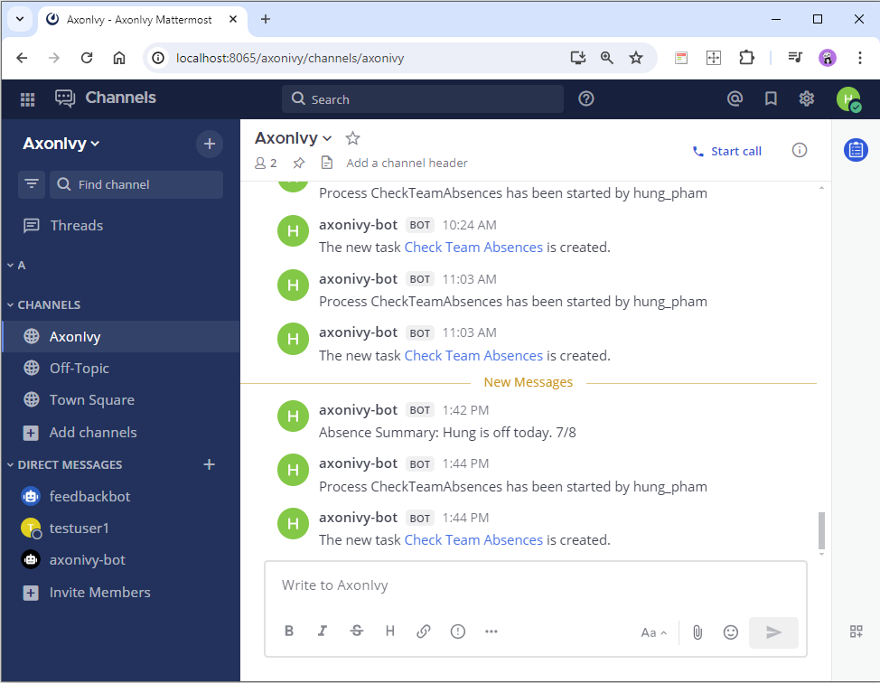
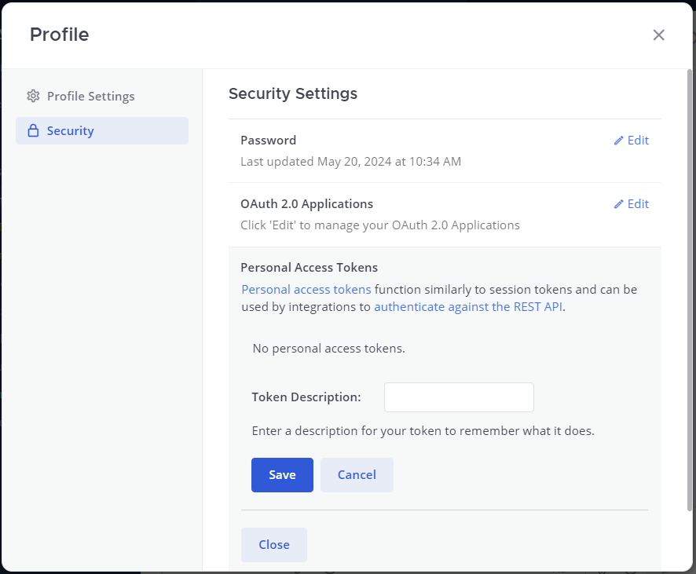
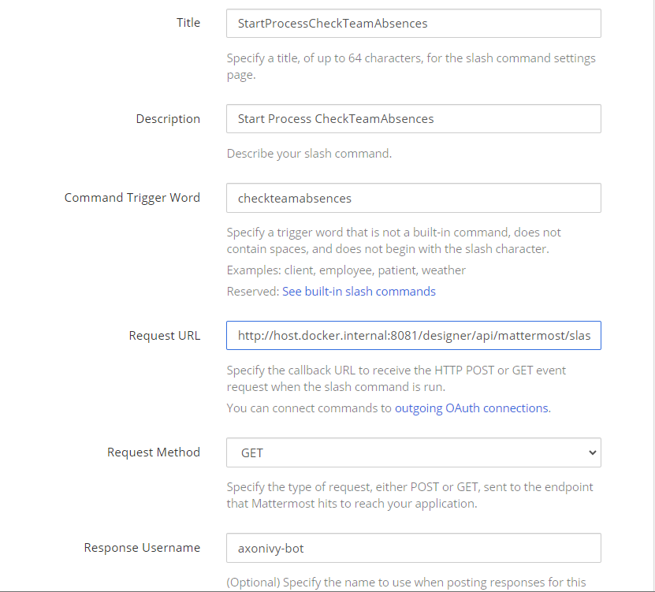
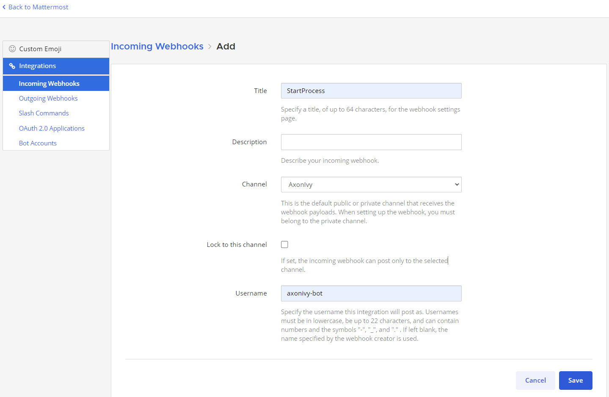

# Mattermost-Konnektor

Der Mattermost-Konnektor von Axon Ivy hilft Ihnen dabei, Initiativen zur
Prozessautomatisierung zu beschleunigen, indem er Mattermost-Funktionen
innerhalb kürzester Zeit in Ihre Prozessanwendung integriert.

Dieser Konnektor:

- unterstützt Sie mit einer Demo-Implementierung, um Ihren Integrationsaufwand
  zu reduzieren.
- gibt Ihnen die volle Kontrolle über die
  [Mattermost-APIs](https://api.mattermost.com/).
- Sie können den Axon Ivy-Prozess starten, indem Sie die Slash-Befehlstaste im
  Mattermost-Kanal drücken.
- Sie können eine Nachricht vom Axon Ivy-Arbeitsplatz an den Mattermost-Kanal
  senden.
- Benachrichtigt Benutzer im Kanal über neue Axon Ivy-Workflow-Aufgaben.

## Demo

1. Drücken Sie die Slash-Befehlstaste im Chat des Kanals. Der Axon Ivy-Prozess
   wird ausgelöst und erstellt eine neue Aufgabe. Die Informationen zur Aufgabe
   werden per Nachricht an den Kanal gesendet.



2. Klicken Sie auf den Link, starten und beenden Sie die Aufgabe. Die Daten aus
   dieser Aufgabe werden an den Kanal zurückgesendet.



### Einrichtung

Mattermost-Instanz

1. Siehe [Deploy
   Mattermost](https://docs.mattermost.com/guides/deployment.html).
2. Team, Benutzer, ... erstellen
3. Gehen Sie zur Systemkonsole, um persönliche Zugriffstoken zu aktivieren!
   [enable-personal-access-token](images/enable-personal-access-token.png)
4. Gehen Sie zum Profil und erstellen Sie unter der Registerkarte „Sicherheit“
   persönliche Zugriffstoken. Der Zugriffstoken wird für die Konfiguration der
   Ivy-Variablen verwendet.
   
5. Aktivieren Sie die Bot-Kontoerstellung und erstellen Sie ein Bot-Konto, um
   Benachrichtigungen an den Kanal Axon Ivy zu senden. Z. B. axonivy-bot
6. Erstellen Sie einen Slash-Befehl im Menü „Integrationen”.
   
7. Erstellen Sie einen eingehenden Webhook für den Kanal, den Axonivy verwenden
   kann, und veröffentlichen Sie Daten im ausgewählten Kanal.
   

Fügen Sie die folgenden Variablen „ `“` zu Ihren Variablen „ `“ variables.yaml`
hinzu:

- `Variablen.mattermost.baseUrl`
- `Variablen.mattermost.accessToken`
- `Variablen.mattermost.teamName`
- `Variablen.mattermost.botName`

Ersetzen Sie die Werte durch Ihre angegebenen Einstellungen.

```
@variables.yaml@
```
