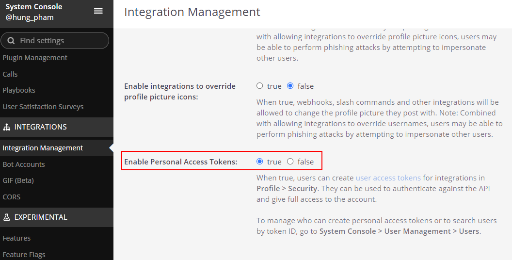

# Mattermost Anschluss

#Axon Efeus mattermost Anschluss hilft du zu beschleunigen Arbeitsgang
Automatisierung Initiativen integrieren mal Mattermost Charakterzüge hinein
euren Arbeitsgang Antrag innerhalb keine Zeit.

Dieser Anschluss:

- Unterstützt du mit eine Demo Ausführung zu heruntersetzen eure Integration
  Anstrengung.
- Gibt du volle Kraft zu die [Mattermosts APIs](https://api.mattermost.com/).
- Erlaub dir zu starten den #Axon Efeu verarbeitet mal den Schnittwunde Befehl
  treffen Schlüssel von den mattermosts Kanal.
- Erlaub dir zu senden eine Meldung zu die mattermosts Kanal von den #Axon Efeu
  Arbeitsplatz.
- #Bekannt geben Nutzer auf dem Kanal für neu #Axon Efeu workflow Tasks.

## Demo

1. Triff den Schnittwunde Befehl Schlüssel auf den KanalsSchwatz. Der #Axon Efeu
   verarbeitet will sein #auslösen und schaffen einen neuen Task. Der
   TasksAuskunft will sein gesandt zu dem Kanal #bei einer Meldung.


2. Klick auf dem Band, Start und Schluss Task. #Der #Daten von diesem Task will
   sein zurückgesandt zu dem Kanal.


### Einrichtung

Mattermost Instanz

1. Ref Zu [#Aufbieten
   Mattermost](https://docs.mattermost.com/guides/deployment.html).
2. Schaff Mannschaft, Nutzer, ...
3. Geh zu die System Konsole zu aktivieren Persönliche Zugang Automatenmünzen
   
4. Geh zu dem Profil und schaffen Persönliche Zugang Automatenmünzen auf den
   Sicherheit Deckel. Die Zugang Automatenmünze ist benutzt für den Efeu
   variable Konfiguration.
   
5. Aktivier Bot Konto Kreation und schaffen eine bot Konto für senden Mitteilung
   zu das Kanal #Axon Efeu. #Z.B. axonivy-bot
6. Schaff einen Schnittwunde Befehl in die Integrationen Speisekarte.
   
7. Schaff ein incoming webhook für den Kanal dass den axonivy kann benutzen und
   einwerfen #Daten zu dem exklusiven Kanal.
   

Füg zu die Gefolgschaft `Variablen` zu eure `Variablen.yaml`:

- `Variablen.mattermost.baseUrl`
- `Variablen.mattermost.accessToken`
- `Variablen.mattermost.teamName`
- `Variablen.mattermost.botName`

Und austauschen die Werte mit eurer #gegeben Einrichtung.

```
@variables.yaml@
```
